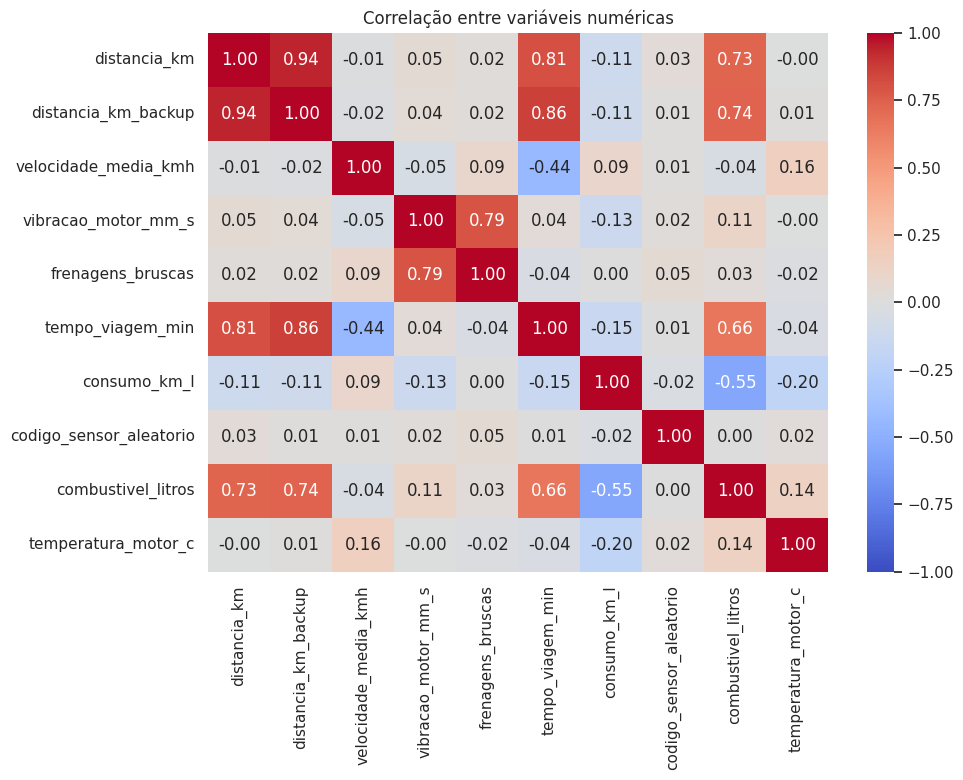

# Relatório da Atividade Avaliativa 01

Aluno: Rodrigo Didier
Disciplina: AI + IoT, Limpeza de Dados em Monitoramento de Frota com IoT
Data: 19/05/2026
Base trabalhada: `dados_frota_iot_sujos.csv` até `dados_frota_iot_limpos.csv`

## 1. Contexto

A empresa monitora uma frota com dispositivos IoT que enviam telemetria de distância, combustível, velocidade média, temperatura do motor, vibração, frenagens bruscas e status de manutenção. A base sintética chegou cheia dos problemas que aparecem em dados reais: datas em formatos misturados, unidades trocadas, valores ausentes, duplicatas, leituras fisicamente impossíveis e categorias com grafias diferentes. Neste relatório eu descrevo o que encontrei em cada etapa, o que fiz para corrigir e como a base ficou no final.

## 2. Etapas de limpeza

A tabela abaixo resume o pipeline, seguindo a estrutura pedida no enunciado.

| Etapa | Problema encontrado | Técnica aplicada | Resultado |
|---|---|---|---|
| Duplicatas | 25 linhas repetidas na base suja | `drop_duplicates()` | 25 linhas removidas (de 545 para 520) |
| Ausentes | `observacao_operacional` com 86,06% de ausência; numéricas como distância, combustível, velocidade, temperatura e vibração entre 2,5% e 4,8% | Removi a coluna com mais de 80% de ausência e imputei o resto: mediana nas numéricas, moda nas categóricas | 1 coluna removida; 8 numéricas imputadas (distância 76,25; combustível 17,42; temperatura 88,50); modas `normal`, `caminhao` e `baixo` |
| Categorias inconsistentes | `tipo_veiculo` com 14 grafias (Caminhão, CAMINHAO, truck, ônibus, bus, utilitario, etc.), `status_manutencao` com variações (ok, OK, alerta, grave), nomes de motorista com caixas e espaços diferentes | Padronização de texto: tirei acento, apliquei strip e lower, usei regex para pegar o número do veículo e mapeei para um nome único | `tipo_veiculo` virou 3 categorias (caminhao 184, van 168, onibus 168); `status_manutencao` ficou em normal, atencao e critico |
| Unidades misturadas | Combustível registrado em litros e em galões; temperatura em Celsius e em Fahrenheit, tudo como texto | Extraí o número com regex e converti: galão vezes 3,78541 para litro, e (F menos 32) vezes 5/9 para Celsius | Criei `combustivel_litros` e `temperatura_motor_c` como float; descartei as colunas de texto |
| Inconsistências físicas | Distâncias negativas (5), velocidades acima de 130 km/h (6), temperatura de 999 °C (5), frenagens negativas (4) | Regras booleanas (maior que 0, between(0,130), between(40,130)) que marcam o valor inválido como NaN, depois imputado pela mediana | 123 valores marcados como inválidos e corrigidos (distância 27, combustível 30, velocidade 21, temperatura 22, vibração 19, frenagens 4) |
| Outliers | Vibração de 7,5 a 11 mm/s, frenagens de 18 a 35, combustível em casos isolados | Comparei IQR (fator 1,5), z-score (3,0 e 2,5) e DBSCAN (eps 1,8, min_samples 8) | IQR removeu 29 linhas, z-score(3,0) 15, z-score(2,5) 26 e DBSCAN 19. Fiquei com a versão do IQR, 491 linhas |
| Redundância | `distancia_km_backup` (cópia de `distancia_km`), `id_viagem` (identificador) e `codigo_sensor_aleatorio` (ruído) | `drop(columns=[...])` depois de olhar o heatmap de correlação | 3 colunas removidas, base final com 14 colunas |

## 3. Matriz de correlação

O heatmap deixou três coisas claras. A `distancia_km_backup` tem correlação 1,00 com `distancia_km`, ou seja, é a mesma informação repetida, então removi. A `distancia_km` e o `combustivel_litros` andam juntos, com correlação positiva alta, o que faz sentido pela própria física do consumo e ajuda no alvo de regressão. Já o `codigo_sensor_aleatorio` não se correlaciona com nada, confirmando que é ruído e pode sair.

## 4. Análise da Atividade 15

As colunas categóricas nominais são `veiculo`, `tipo_veiculo`, `motorista`, `status_manutencao` e `risco_falha`. Dessas, `status_manutencao` e `risco_falha` têm uma ordem natural (normal antes de atenção antes de crítico; baixo antes de médio antes de alto), então dá para tratar como ordinais. As outras três não têm ordem.

Todas as cinco precisam de algum encoding para entrarem em um modelo. Para `tipo_veiculo`, que tem só 3 valores, usaria one-hot. Para `status_manutencao` e `risco_falha`, um encoding ordinal aproveita a ordem. Já `veiculo` (cerca de 25 valores) e `motorista` (12 valores) ficam melhor com frequency encoding ou target encoding, porque one-hot deixaria a matriz muito esparsa.

As escalas das variáveis numéricas são bem diferentes entre si. O `tempo_viagem_min` vai de 10 a 360 e a `distancia_km` de 15 a 244, enquanto a `vibracao_motor_mm_s` fica entre 1 e 4 e as `frenagens_bruscas` entre 0 e 6. Velocidade, temperatura, combustível e consumo ficam em faixas intermediárias. Por causa dessa diferença de magnitude, é importante aplicar StandardScaler ou MinMaxScaler antes de modelos que dependem de distância (KNN, SVM, DBSCAN) ou de regularização (Ridge, Lasso, regressão logística).

Para classificação, o alvo natural é o `risco_falha`, com três classes (baixo, médio e alto). Para regressão, o melhor alvo é o `combustivel_litros`, que é contínuo e tem relação forte com distância e tipo de veículo; o `consumo_km_l` seria uma alternativa.

Sobre o que remover antes de modelar: `id_viagem`, `codigo_sensor_aleatorio` e `distancia_km_backup` já saíram, por serem identificador, ruído e cópia. A `data_viagem` eu removeria também, a menos que valha a pena extrair atributos de tempo dela (hora, dia da semana). O `motorista` pode sair se a ideia for modelar o veículo e não o operador. E tem um ponto importante: o `status_manutencao` foi derivado do `risco_falha` na geração da base, então usá-lo como entrada para prever `risco_falha` seria vazamento de informação; nesse caso ele tem que ficar de fora.

## 5. Por que escolhi a base do IQR

Comparando os três métodos sobre a base já tratada (520 linhas), o IQR ficou com 491 linhas (removeu 29), o z-score com limite 3,0 ficou com 505 (removeu 15) e o DBSCAN com 501 (removeu 19). A média de vibração caiu de 2,615 para algo em torno de 2,47 nos três métodos, e a de frenagens caiu de 1,58 para cerca de 1,11, então o efeito sobre as médias foi parecido.

Fiquei com o IQR mesmo sendo o mais agressivo. Ele é o método mais fácil de explicar: trabalha variável por variável, não depende da média (que justamente os outliers distorcem) e não exige ajustar parâmetros sensíveis como o `eps` do DBSCAN. As 29 linhas que ele tirou batem com os outliers que foram injetados de propósito na geração da base (vibração de 7,5 a 11 e frenagens de 18 a 35), que são os pontos que mais atrapalham médias e regressões. Como depois quero treinar um classificador de risco e uma regressão de consumo, achei melhor abrir mão de 5,6% das linhas para ter distribuições mais estáveis. Se eu precisar estudar os eventos extremos, faço isso num pipeline separado de detecção de anomalias, sem misturar com o modelo principal.

A base final, `dados_frota_iot_limpos.csv`, ficou com 491 linhas e 14 colunas: 8 numéricas, 5 categóricas e a `data_viagem` em formato de data.
